# RP6502 Ep2 — Hooking up the 6502

**Video:** Second episode; focuses on connecting the 6502 to the dual–Pi Pico design: memory map, reset/clock, and PIO/DMA for the 32-byte "register" space. Still **prototype-era** (breadboard, two Picos). Current Picocomputer (PCB, RIA + VGA, W65C02S, etc.) evolved from this — use official docs and schematic for today's design.

---

## Historical context (6502 clock speeds)

- **Commodore, Apple:** ~1 MHz  
- **BBC Micro:** 2 MHz  
- **Old NMOS 6502:** peak ~3 MHz  
- **This design:** new **CMOS** (e.g. W65C02S), specced at **8 MHz** in the video's design  

Goal in the episode: configure the Pi Pico for an **8 MHz 6502 bus**.

## Dual Pi Pico design (recap from Ep1)

- **Ep1:** One Pico had direct access to 6502 RAM; USB host for keyboards/storage; second Pico in device mode for debugging.  
- **Ep2:** "All in" on **two Picos** — fewer parts, more RAM, cheaper, faster, better video and sound.  
- **No hidden costs:** No PS/2 keyboards or volatile used market; no one-off programming hardware; not even RS-232.

## Memory map (6502 single address space)

- 6502 has **no separate I/O bus** and **no memory manager** — one address space; placement of everything matters.  
- **Special locations:** Reset vector (required for a program to run after reset); interrupt vectors (ignored for this test).

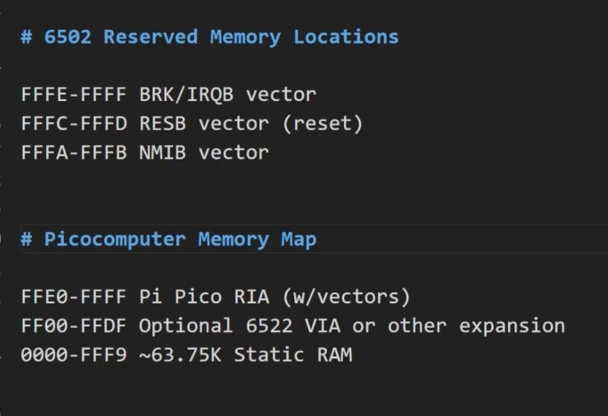

- **Picocomputer (this design):** **No ROM** — all RAM, with the **last page (256 bytes)** reserved for the Pi Pico and hardware.  
- **Pico in the map:** Occupies the range that includes the reset and interrupt vectors; appears as **32 bytes of RAM**. Six bytes are vectors; **26 bytes** for I/O.

- **Bootloader idea:** A tiny program in those 26 bytes (only **10 bytes** needed for a bootloader) can load the full 64K and continue execution there.  
- **Goal in this video:** Only run code in those **32 bytes** — RAM is not hooked up yet.

## Reset and clock (6502 startup)

- **RESB (reset):** Must be held low for **at least two clock cycles** (datasheet); driven from a Pi Pico GPIO.  
- **PHI2 (clock):** Phase 2 input; also GPIO from the Pi Pico.

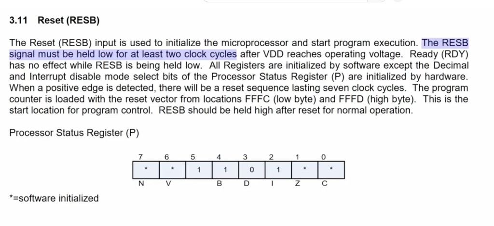

- **For this test:** Reset and single-step are **not** physical buttons on the final design; for the prototype they're implemented with a **USB keyboard**: **F1** = reset sequence (two clock pulses), **F2** = single clock cycle. Blocking sleeps are fine for this non-production code.

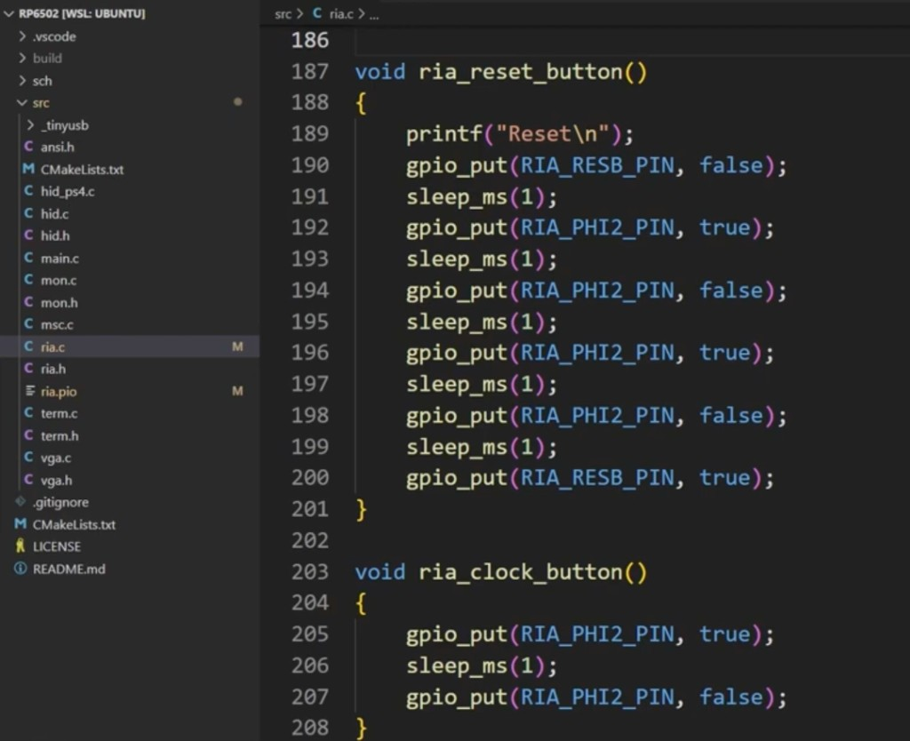

- **Scope check:** 1 ms software delays; time base 1 ms on scope; clock button → one pulse; reset → expected two-cycle sequence.

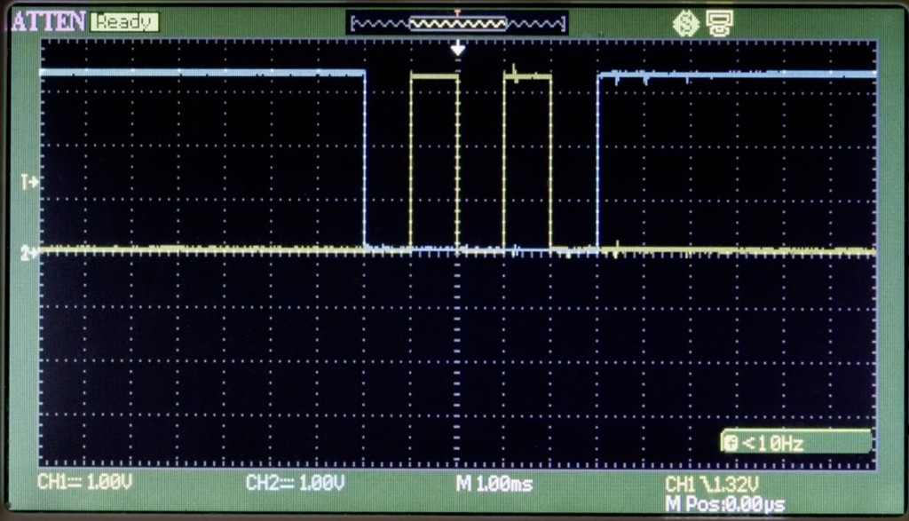

## Data and address buses (PIO + DMA, not bitbang)

- **Bitbanging** the 6502 is a good teaching tool but rarely used outside the classroom; here the Pi Pico uses **DMA and PIO** so that a **fraction** of DMA/PIO is used and **no CPU** is needed for the bus.  
- **Tradeoff:** Bitbang = a few lines of easy code (high-level, human-friendly). PIO/DMA = operations "similar to a single step of microcode" — one level below CPU machine code.  
- **32-byte "registers":** Placed in an unused block of RAM so they don't share space with anything else.

![ria.c — regs[0x1F] declaration at 0x20040000, pin defines, vram layout](ep02-assets/ria-c-regs-declaration.png)

## PIO program (address and data pins)

- **Separate file:** PIO program for the **data and address** pins.  
- **IN / OUT:** Read address bus, write data bus. **Wrap** directives form the loop. Data moves over **FIFOs**.  
- **PULL and MOV:** At init, the PIO is given the **base address** of the registers. It saves it and builds a **full 32-bit address** with the **lower 5 bits** from the GPIO (address pins) — same clock cycle as reading the 6502 address bus.

- **C side:** PIO programs are compiled into headers by the build system; the CPU **loads and runs** them (pin assignments and a **PUT** that passes the register base address to the PIO). Once started, PIO keeps running even if both CPUs halt.

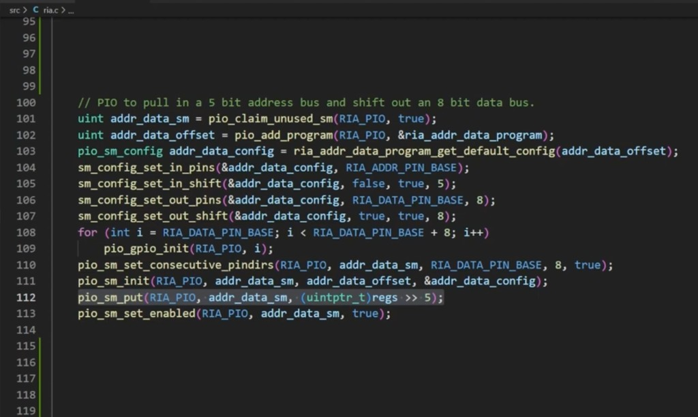

## DMA loop (address → data → PIO)

- **Two DMA channels**; the "loop" is one channel triggering the other and back.

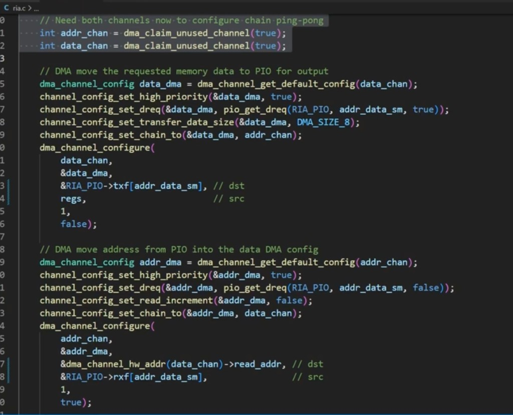

- **Address DMA:** Source = **PIO FIFO** (`&RIA_PIO->rxf[addr_data_sm]`). Destination = **data DMA's source address** (`&dma_channel_hw_addr(data_chan)->read_addr`) — so the data DMA reads the correct register.

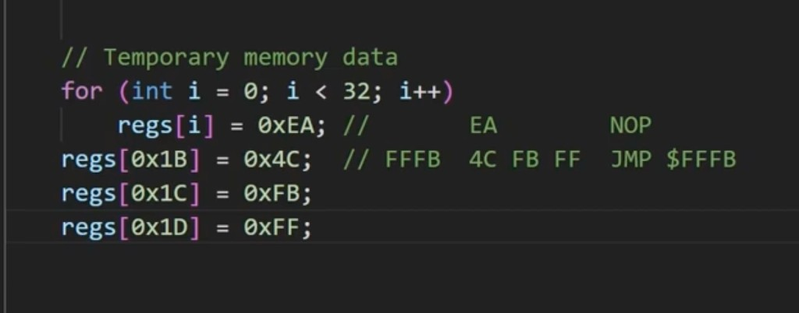

- **Data DMA:** Source = that register (written by address DMA). Destination = **PIO FIFO** (`&RIA_PIO->txf[addr_data_sm]`) — value to drive on the data bus.  
- **Cycle (recap from video):**

## Test program in the 32 bytes

- **Fill** the 32 bytes with **NOPs** (`0xEA`).  
- **At $FFFB:** Put **JMP $FFFB** (`4C FB FF`) — infinite loop. Any glitch exits the loop and runs NOPs.  
- **Side effect:** $FFFC–$FFFD hold the reset vector; placing the JMP at $FFFB also sets the reset vector.

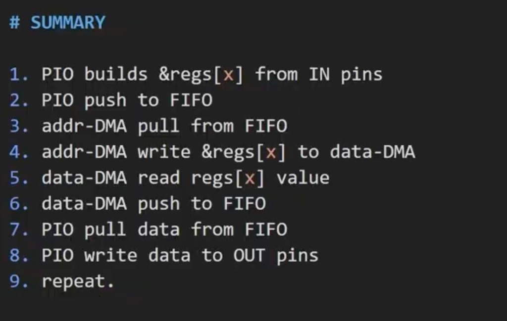

- **Access time (before 6502):** Clock tied to an address line to simulate a request; scope shows delay from address change to data change. **50 ns** divisions; result **well under 500 ns** (needed for 1 MHz).  
- **Then:** 6502 datasheet — pins that must be high when unused; then connect reset, clock, address, and data.

## Bringing up the 6502

- **Reset + seven clocks:** Observe address bus (e.g. serial "address bus watcher" from the Pico). See **$FC** (reset vector low byte), then **$FD $FD** — then one more cycle per JMP iteration.

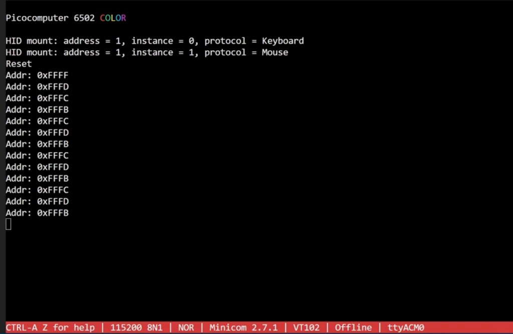

- **Single-step:** Every **three** clock presses = one iteration of the JMP loop.  
- **Free-running clock:** 6502 clock set "astable"; serial can't keep up, so a **logic analyzer** is used (two channels; a third would have helped).  
- **Stability check:** The JMP loop only toggles **three** address lines; any glitch shows on the others. At **1 MHz** the decoded address shows the loop at FB/FC/FD as expected; capturing seconds shows no dropouts.  
- **4 MHz:** Initially "not fast enough"; need to improve timing.

## Syncing Pico to the 6502 (4 MHz then 8 MHz)

- **Idea:** Pi Pico not originally synchronized with the 6502; **sync** by having the PIO wait for the 6502 clock.  
- **Timing:** 6502 presents a new address when the clock goes **low**; on the scope the **address bus lags slightly** behind the Pico-generated clock. Datasheet "address setup time" wasn't useful; timing was taken from the scope.  
- **Change:** In the PIO, **wait for clock low** and add a **delay of 2 PIO cycles** (in brackets). Varying the delay gave predictable behavior.

![ria.pio — updated with `wait 0 gpio 21 [2]` to sync PIO to PHI2 clock](ep02-assets/ria-pio-with-wait.png)

- **Result:** **4 MHz** stable. Access time under the **145 ns** required for 4 MHz, but not the **70 ns** needed for 8 MHz.

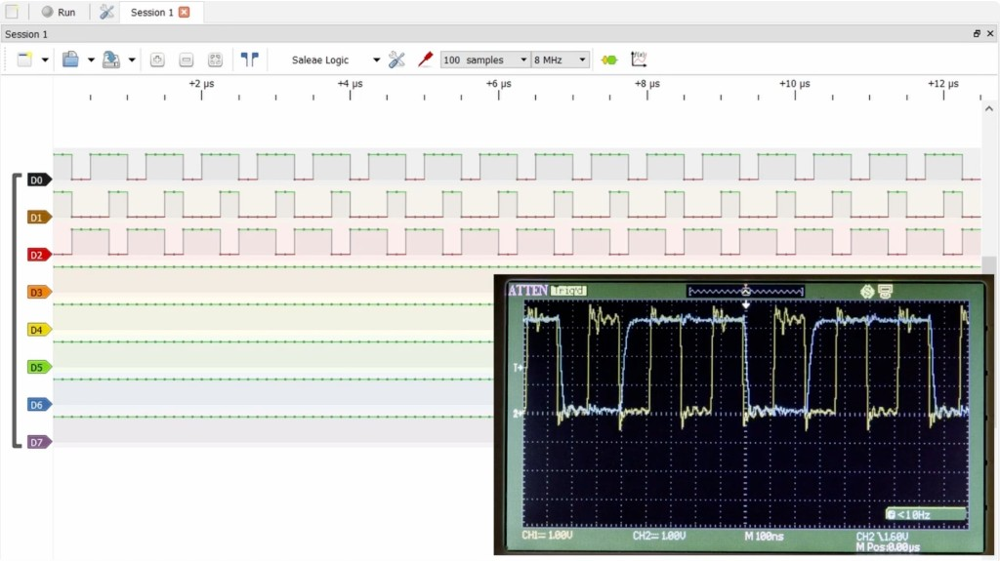

- **Final step:** **Double the Pi Pico clock** → **6502 at 8 MHz**.

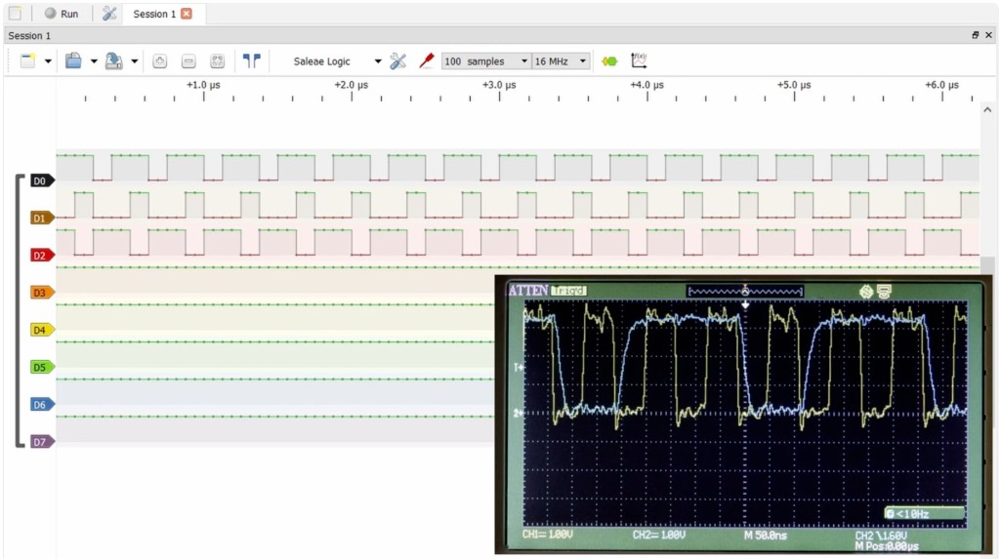

## End of episode

- All major systems of the Picocomputer have been tested at this point.  
- **Next video:** Make the 32 bytes **writable** (so the 6502 can use them for real I/O, not just read).

---

## Takeaways for current Picocomputer

- **RIA + VGA:** The "32 bytes" and PIO/DMA concept evolve into the current **RIA** (register interface, OS, XRAM, USB, UART) and **VGA Pico**; official hardware docs describe the actual memory map and register layout.  
- **Clock:** Current design runs the 6502 at the intended bus speed (see hardware docs); the episode explains *why* sync and Pico clock matter.  
- **No ROM, boot from "registers":** Conceptually aligned with today's "no ROM, boot from RIA" approach; implementation details are in the repo and docs.

---

## Source

- Transcript: user-provided (RP6502 Ep2 — "Hooking up the 6502").
- Author's design notes and code: GitHub repository linked in the video description.
- For current hardware and firmware: https://picocomputer.github.io/ and the `rp6502` / `picocomputer.github.io` repos.
