# RP6502 Ep3 — Glue Logic and 6502 Writes

**Video:** Third episode; focuses on address-decoding glue logic, making the 6502's 32-byte RIA register space writable, and troubleshooting a logic-family speed problem at high clock rates. Still **prototype-era** (breadboard, two Picos). Current Picocomputer (PCB, RIA + VGA, W65C02S, etc.) evolved from this — use official docs and schematic for today's design.

---

## Breadboard tour

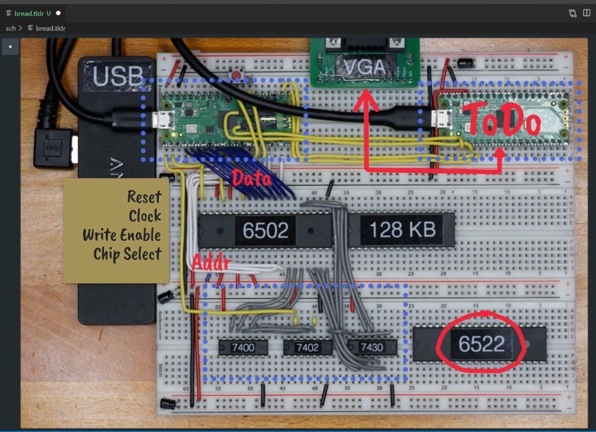

- **VGA Pico:** Only running the debugger at this point (not doing video yet).
- **USB/RIA Pico:** The one being developed — handles everything except video.
- **RIA** (Register Interface Adapter): The author's name for the Pi Pico's connection to the 6502, analogous to a PIA, CIA, TIA, or VIA. "RIA wasn't taken."
- **Connections to Pico:** 8 data (blue), 5 address (white), 4 control signals (reset, clock, write enable, chip select). Reset and clock were done in Ep2. Write enable is a direct connection. **Chip select** must be computed — that's the new glue logic.
- **Gray wires:** Generate the chip select signals via three logic chips.

## 6522 VIA (Versatile Interface Adapter)

- The 6502 is a **microprocessor**, not a microcontroller — no built-in GPIO or timers.
- Lots of 6502 software expects **timer-driven interrupts**, so the Picocomputer allows for an **optional 6522 VIA**.
- In vintage computers the VIA's GPIO pins drove keyboards, disk drives, etc. Here, the Pico handles all that, so the VIA's GPIO pins are **free for user projects**.

## Glue logic overview

The Picocomputer uses clocks and power from the Pi Pico boards but still needs a few traditional logic gates:

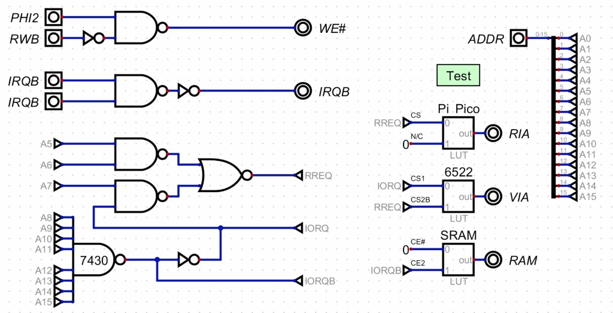

### WE# (Write Enable for RAM)

- First NAND: synchronizes RAM writes. The 6502 updates the address bus at the **same moment** the R/W signal switches. This gate prevents **write corruption** during that transition by gating with PHI2.

### IRQB (Interrupt combining)

- Second NAND: combines interrupt signals from the Pi Pico RIA and 6522 VIA. The author's 6522 needs them **ORed** (not open-collector as on some other systems).

### Address decoding

- Adding multiple devices to the 6502 bus requires logic to select the right device at the right time.
- Decode the **16-bit address** into individual chip-select lines for RIA, VIA, and RAM.

## Simulation tool: Digital

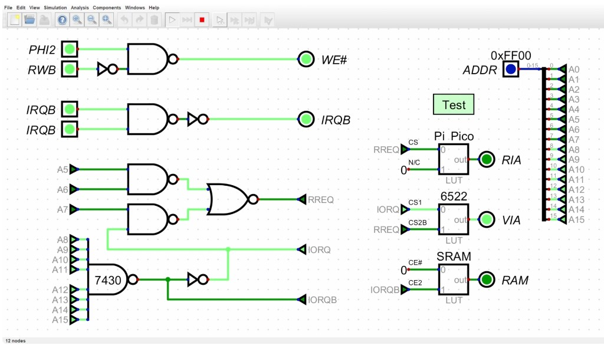

The author uses **[Digital](https://github.com/hneemann/Digital)** — an open-source digital logic simulator by H. Neemann (Java). The `.dig` file (`RIA.dig`) used to live in the `sch/` folder of the [rp6502](https://github.com/picocomputer/rp6502) repo; that folder was removed in Apr 2023 (commit "sch moved to docs") and was not added to another org repo. To get the file, recover from git history: `git show fffccaa^:sch/RIA.dig > sch/RIA.dig` (see [RIA_DIG_GIT_HISTORY.md](../tools/RIA_DIG_GIT_HISTORY.md)). The right side of the schematic is a **test harness** that lets you set a 16-bit address and see which of the three devices (RIA, VIA, RAM) is selected.

## Memory map and address placement

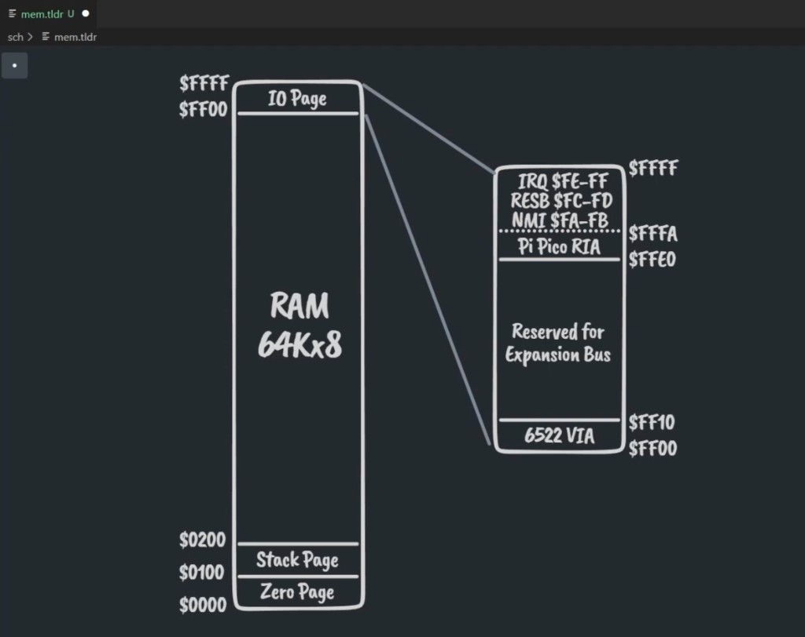

- The 6502 addresses at most **64 KB**. A full 64K of RAM would be ideal but the VIA and Pico need address space too; an **expansion area** is also reserved.
- Interface chips typically need 4–32 addresses, so **one page (256 bytes)** at the top is reserved for I/O.
- **Why the last page?** The highest six bytes ($FFFA–$FFFF) are the 6502's **interrupt and reset vectors**. Putting the Pico there lets it **bootstrap** the 6502.

### Address decoding details

| Device | Address range | How decoded |
|---|---|---|
| **RAM** | $0000–$FEFF | Selected whenever there is **no I/O request** (IORQB high → CE# low on SRAM) |
| **6522 VIA** | $FF00–$FF0F (16 bytes) | IORQ + lower-address bits via VIA's **two built-in chip selects** (CS1 / CS2B) |
| **Pi Pico RIA** | $FFE0–$FFFF (32 bytes) | RREQ signal decoded from A5–A7 + IORQ, using four gates |

- **7430:** An 8-input NAND decoding address lines A8–A15. When all eight are high (address $FFxx), it outputs **IORQ** (I/O request — name borrowed from the Z80).
- **IORQB** (inverted IORQ) directly enables/disables **RAM**.
- The remaining gates decode A5–A7 to distinguish RIA from VIA within the I/O page.
- **Optimization:** Using both CS1 and CS2B on the 6522 steals an extra gate from the VIA chip itself, reducing external chip count.

### Simulation walkthrough (boundary addresses)

The author runs through all boundaries in the Digital simulator:

| Address | Selected device |
|---|---|
| $0000 | RAM (start) |
| $FE00 | RAM (last page of RAM) |
| $FFE0 | Pi Pico RIA (start) |
| $FFFF | Pi Pico RIA (end) |
| $FF00 | 6522 VIA (CS1=low, CS2B=high) |

## Data bus direction and chip select

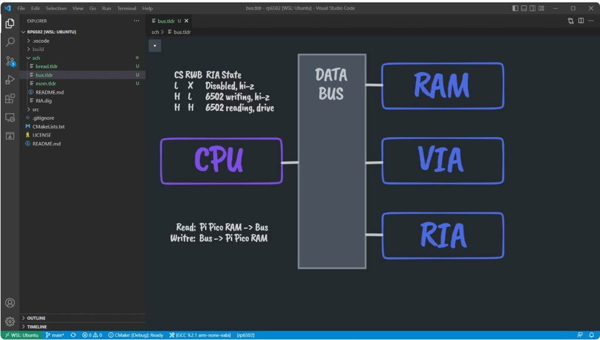

Why chip select was needed **before** making the Pico writable:

- If the 6502 is **writing**, it drives the bus (CMOS). If **reading**, the bus is high-impedance so another chip can drive it.
- **Only one chip** may drive the bus at a time. Each device must check **both** chip select and write enable.
- The Pi Pico RIA has **three states:**
  - **CS low, RWB don't-care:** Disabled, Pico data pins hi-z.
  - **CS high, RWB low:** 6502 is writing; Pico data pins hi-z (reads from bus).
  - **CS high, RWB high:** 6502 is reading; Pico drives the bus.
- The new PIO program must handle all three states, so chip select logic had to be in place first.

## PIO program for read and write (`ria_write`)

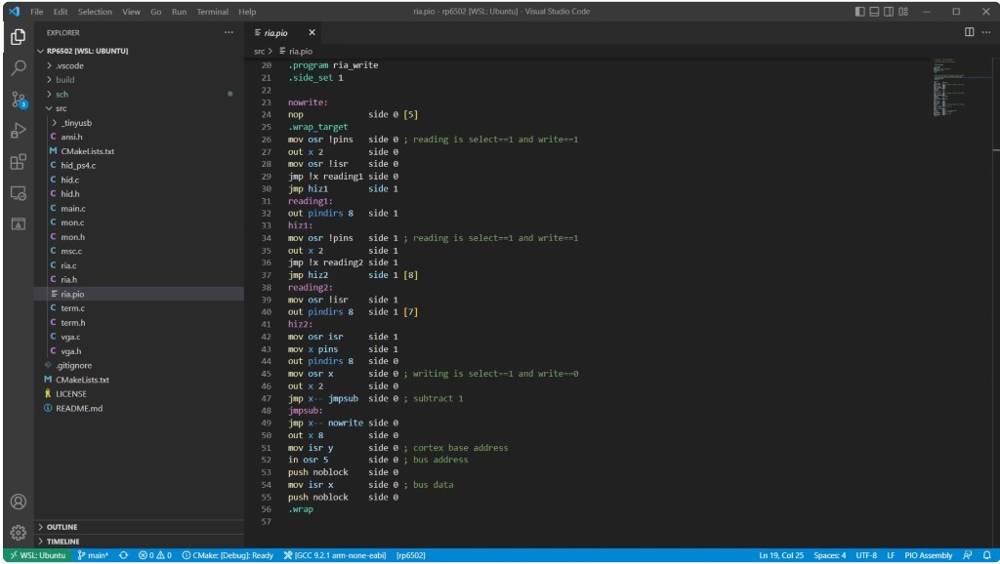

- **Previous episode:** PIO always drove the bus (read-only from 6502's perspective), using DMA.
- **Now:** PIO program handles **bidirectional** data — drives bus on reads, receives bus data on writes.
- Writing moves data **from the data bus to Pi Pico RAM** (the reverse of reading).
- Direction control is synchronized with chip select and write enable signals.
- The program is on GitHub (`src/ria.pio`) for detailed study.

## Test program (write verification)

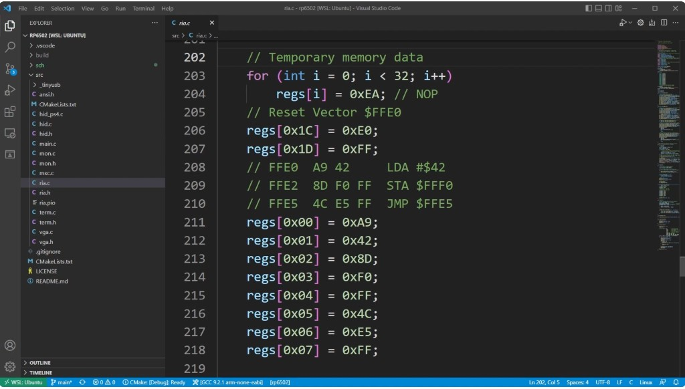

- 32 bytes filled with **NOPs** ($EA).
- **Reset vector** points to $FFE0.
- The program at $FFE0: `LDA #$42` / `STA $FFF0` / `JMP $FFE5` — writes a single value ($42) to address $FFF0, then loops.
- **Instrumentation:** Instead of hooking up DMA, the author temporarily intercepts the **PIO FIFO** and prints writes to the terminal. Press F1 to reset the 6502.

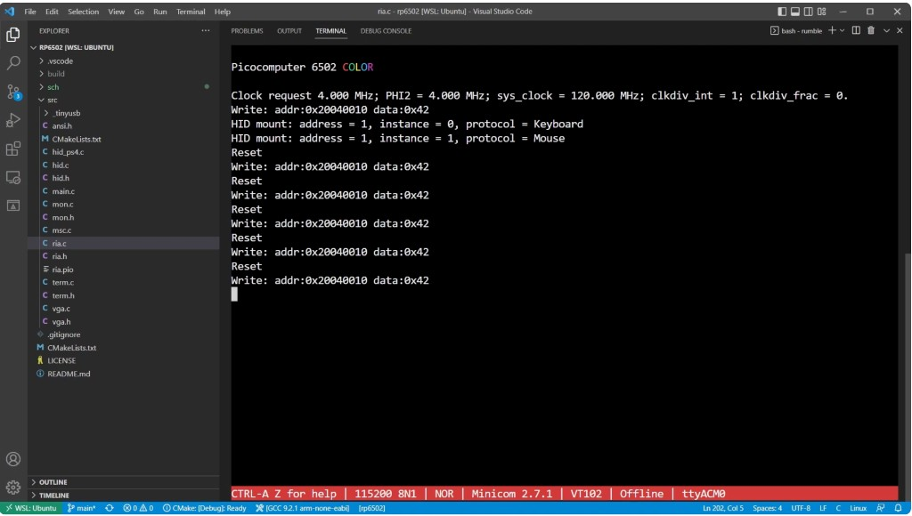

- A single "Write: addr:0x20040010 data:0x42" appears after boot, and again after each reset. This confirms the 6502 is writing $42 to the Pi Pico's register space.

## Overclocking and the speed problem

The author then adds automatic clock-frequency sweeping to test higher speeds.

### First attempt: fails at 7.7 MHz

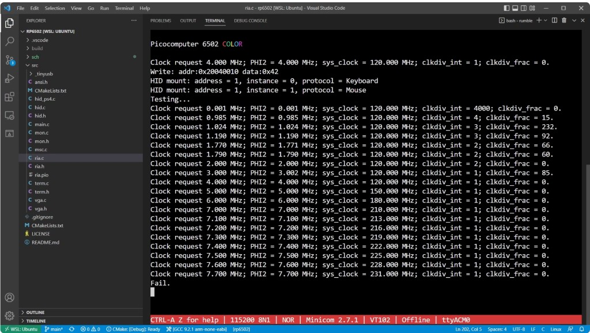

- Test sweeps clock frequency in 100 kHz steps.
- **Failure at 7.7 MHz** — suspiciously close to the 8 MHz target.
- The PIO program was not resource-limited and appeared correct.
- Failing at a precise threshold with 100 kHz granularity pointed to a **hardware** problem.
- **Bypassing** the new chip select glue logic eliminated the failure — confirmed the logic chips were the bottleneck.

### Diagnosis: propagation delay

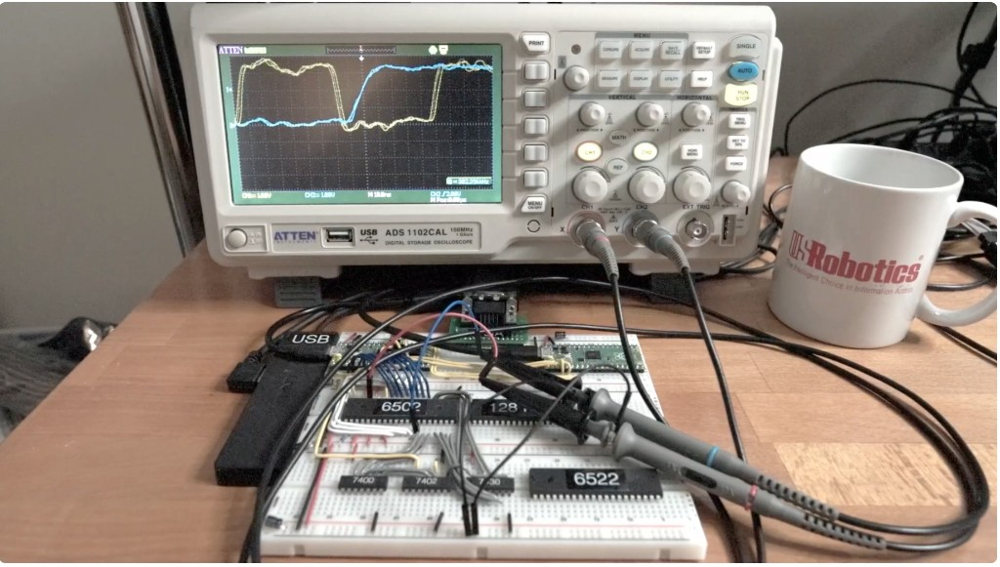

- On the scope: chip select takes **half a clock cycle** to settle after an address change.
- Moving the probe to an address line directly: **~50 ns** propagation delay.
- The signal path through the glue logic is **four gates deep**.
- The HC (CMOS) chips used were rated at ~15 ns per gate. 15 ns × 4 = 60 ns — consistent with the ~50 ns measurement.

### Fix: faster logic family

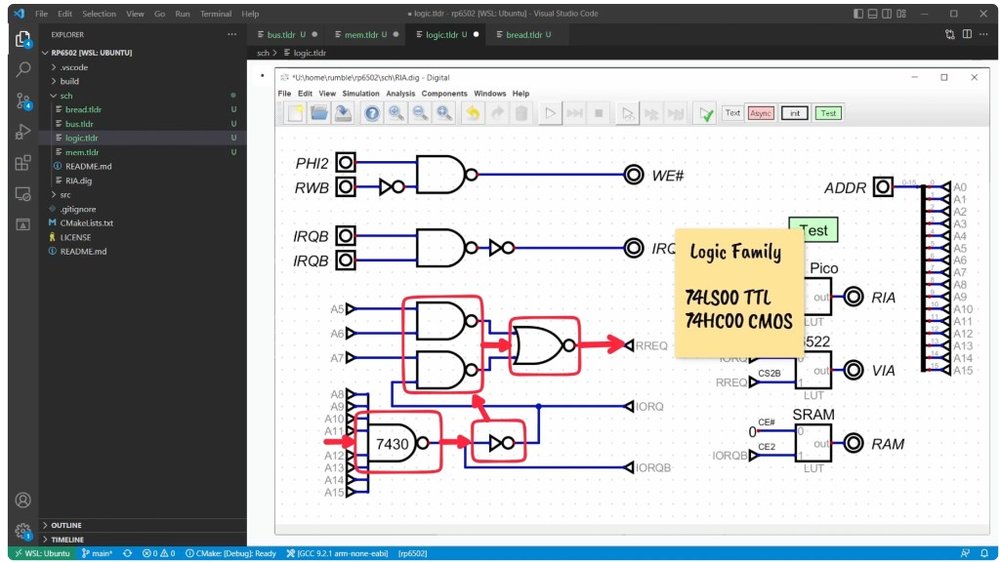

Possible fixes:
- **Programmable logic (PAL/GAL/CPLD):** Too extreme; requires programming hardware.
- **Faster discrete chips:** Switch logic family.

Logic families:
- **74LS00** — TTL (not used)
- **74HC00** — CMOS (original choice, ~15 ns/gate)
- **74AC00** — Advanced CMOS (~5 ns/gate, much faster)

The 7430 (8-input NAND) was **not available** in AC for through-hole, so only 75% of the signal path could be upgraded (the 7400 and 7402).

### After chip swap: success at 9 MHz

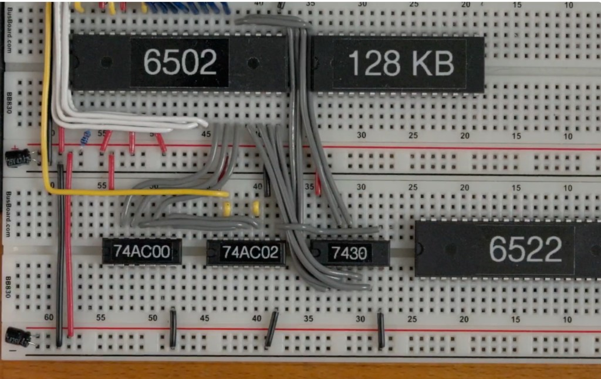

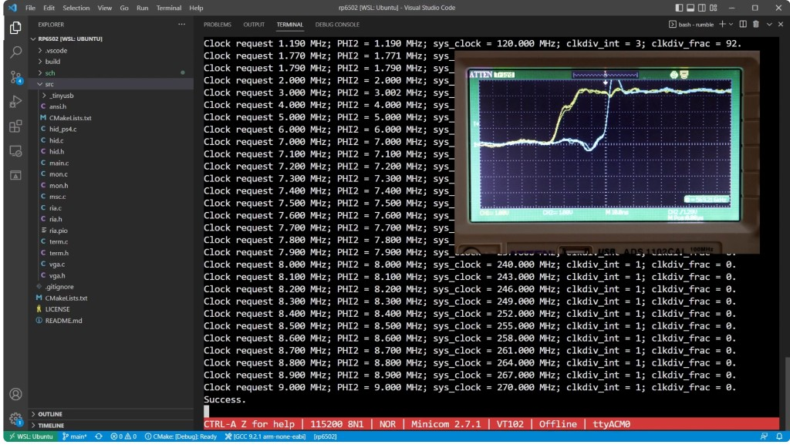

- Swapping the 7400 and 7402 from **HC → AC** reduced propagation delay from **50 ns to 35 ns**.
- Clock test now passes up to **9 MHz** (target was 8 MHz).
- **Outcome:** Requiring AC chips for 8 MHz is reasonable. Support for slower HC chips is easy: default to 4 MHz. The Picocomputer can **self-test** and let 6502 software know if faster speeds are available.

## End of episode

- **Two things remain** before making a circuit board: running code from RAM (next episode) and VGA (after that).
- The 6522 VIA is on the breadboard but not yet in use.

---

## Takeaways for current Picocomputer

- **Glue logic:** The current PCB uses **74AC00, 74AC02, and 74HC30** — exactly the outcome of this episode's troubleshooting. See the `schematic/` repo and official hardware docs.
- **Memory map:** The I/O page layout ($FF00 VIA, $FFE0 RIA, vectors at top) established here is the **final design**; see https://picocomputer.github.io/hardware.html.
- **Self-test / clock:** The Picocomputer tests the bus at startup and selects the highest safe clock speed. Current firmware defaults to 8 MHz for AC logic.
- **Digital simulator:** The `RIA.dig` file in the `sch/` folder can be opened with [Digital](https://github.com/hneemann/Digital) to explore the address decoding logic interactively.

---

## Source

- Transcript: user-provided (RP6502 Ep3 — glue logic and 6502 writes).
- Simulation tool: [Digital by H. Neemann](https://github.com/hneemann/Digital) (open-source, Java).
- Author's design notes and code: GitHub repository linked in the video description.
- For current hardware and firmware: https://picocomputer.github.io/ and the `rp6502` / `picocomputer.github.io` repos.
