# RP6502 Ep6 — ROMs and the filesystem (TinyUSB, FatFs, littlefs)

**Video:** Mass storage options for microcontroller projects: **two file systems** (FAT via **FatFs**, **littlefs** on raw flash), **three kinds of flash** (USB/SD with controllers vs naked Pico flash). How the glue code connects **TinyUSB + FatFs** and **littlefs + Pico SDK**; tour of Picocomputer features: `ls` / `load` from USB, `UPLOAD` from a Linux build machine, **install** / **boot** “ROMs” on RIA flash, `help`, `status`, multi-drive `dir`.  
**Context:** Episode shows **`src/dev/`** in VS Code (WSL); current **rp6502** tree uses **`src/ria/usb/msc.c`**, **`src/ria/sys/lfs.c`**, etc. — same ideas, paths may differ. See [LEARNING_PLAN.md](../LEARNING_PLAN.md) (RIA firmware / storage bullets).

---

## 1. Why two file systems?

| Need | Choice |
|------|--------|
| **Exchange data with PCs** — new SD/USB sticks are usually pre-formatted | **FAT** (via **FatFs**). Variants: FAT12, FAT16, FAT32, **ExFAT**. |
| **Config / “ROM” on the same chip as the MCU** (RP2040 internal flash) | **littlefs** — designed for **raw flash** with **journaling and wear leveling**. |

- **FAT on spinning disks / removable media:** FAT does not do wear leveling; **USB drives and SD cards** have **controllers** that manage wear, so FAT is fine.
- **FAT on naked flash:** Would work for a while but **wears out** unevenly — bad for the Pico’s flash without a controller.
- **Author’s split:** **FatFs** for USB (and SD if used); **littlefs** for internal Pico flash.

**ExFAT caveats:** Not all devices/libraries support it; patented algorithm — check before shipping a product.

**Petite FatFs:** Lighter weight, no ExFAT — author uses full **FatFs**.

---

## 2. Diagram: FatFs vs littlefs (episode slide)

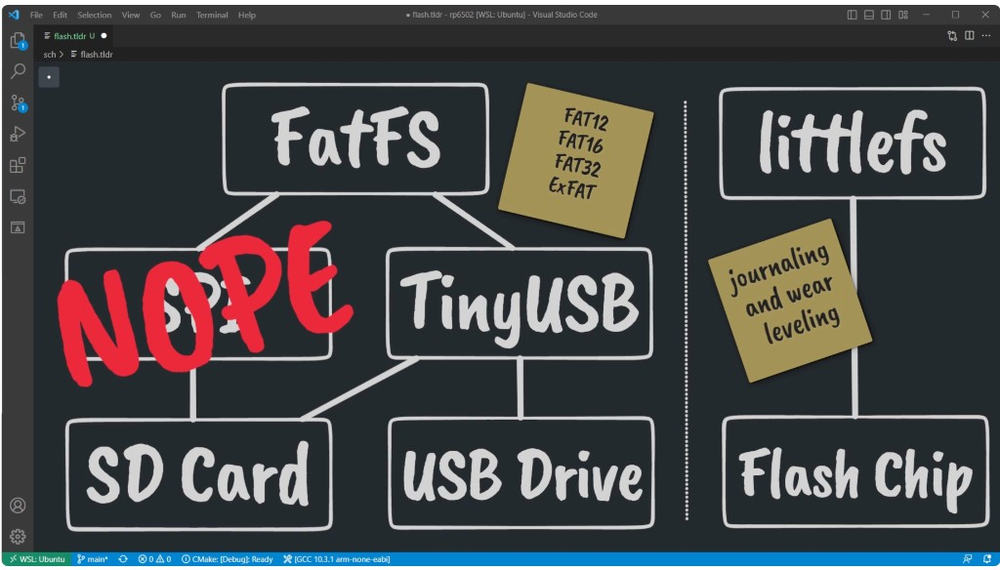

- **SD card:** Can use **SPI** (even bit-banged). Author skips SPI in this episode: SD-over-**USB** adapters exist; **front-accessible** removable media matters for a retro machine, and **USB hubs + extension cables** are cheap (vs “one SD slot not on the front” rule of thumb for modern retro builds).
- **Pi Pico + TinyUSB:** FatFs example in TinyUSB does most of the work.

---

## 3. Three “Glue” pieces: FatFs ↔ TinyUSB (MSC)

The driver needs **three** links between FatFs and TinyUSB:

1. **Geometry** — sector count and sector size (`disk_ioctl`: `GET_SECTOR_COUNT`, `GET_SECTOR_SIZE`, etc.).
2. **Mount / unmount** — TinyUSB `tuh_msc_mount_cb` / `tuh_msc_umount_cb` → FatFs `f_mount` / `f_unmount`.
3. **Read / write** — FatFs `disk_read` / `disk_write` → TinyUSB `tuh_msc_read10` / `tuh_msc_write10` (or equivalent).

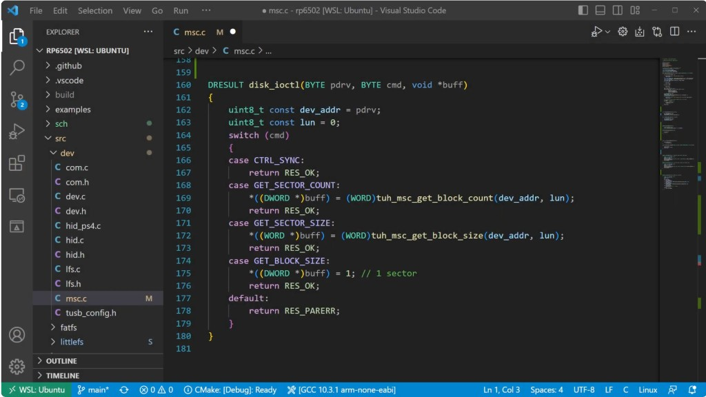

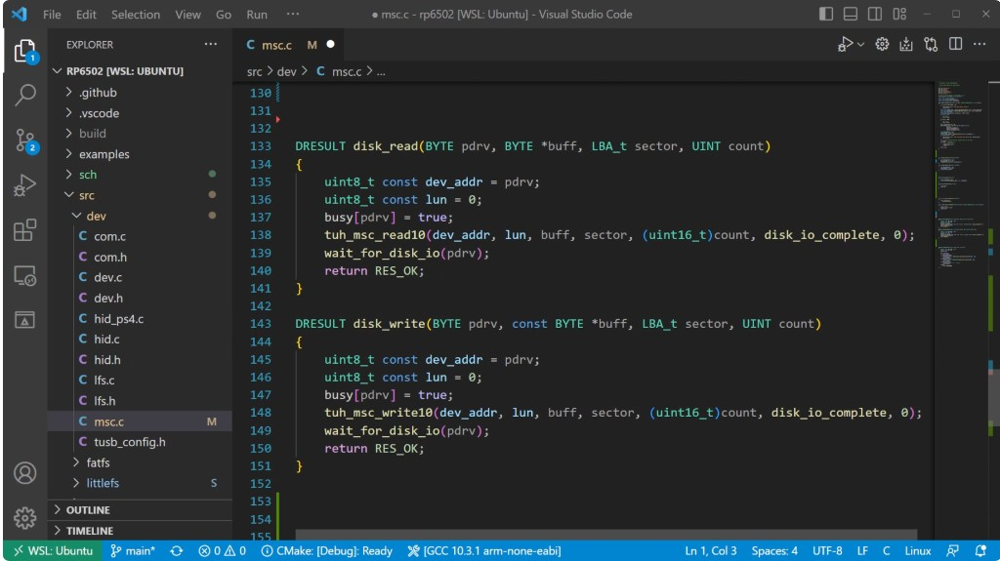

**Non-blocking TinyUSB:** Events are handled in a **task**; FatFs expects blocking I/O. The firmware **polls** until the transfer completes (e.g. `wait_for_disk_io` calling the USB worker repeatedly). **RTOS** would make waiting a bit simpler; this project doesn’t use one.

After that, **`f_open` / `f_read` / `f_write` / `f_close`** work like a small POSIX layer. Author spent more time on **CMake/build** than on the driver — study the **TinyUSB FatFs host example**.

---

## 4. littlefs ↔ Pico flash

No official one-size example; you must know your flash layout.

1. **`lfs_config`** — callbacks: **read**, **prog**, **erase**, **sync**; block sizes, counts, **lookahead** buffer, **cache** buffers, `block_cycles`, etc.

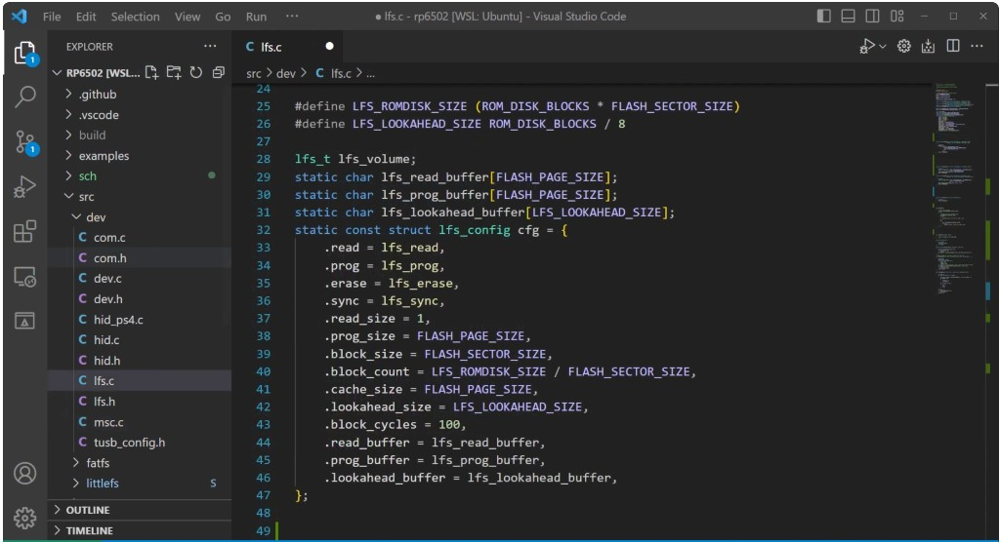

2. **Read:** Pico flash is **XIP** — implement read as **`memcpy`** from a **non-cached** base (e.g. `XIP_NOCACHE_NOALLOC_BASE`, end-of-flash region for the ROM disk).

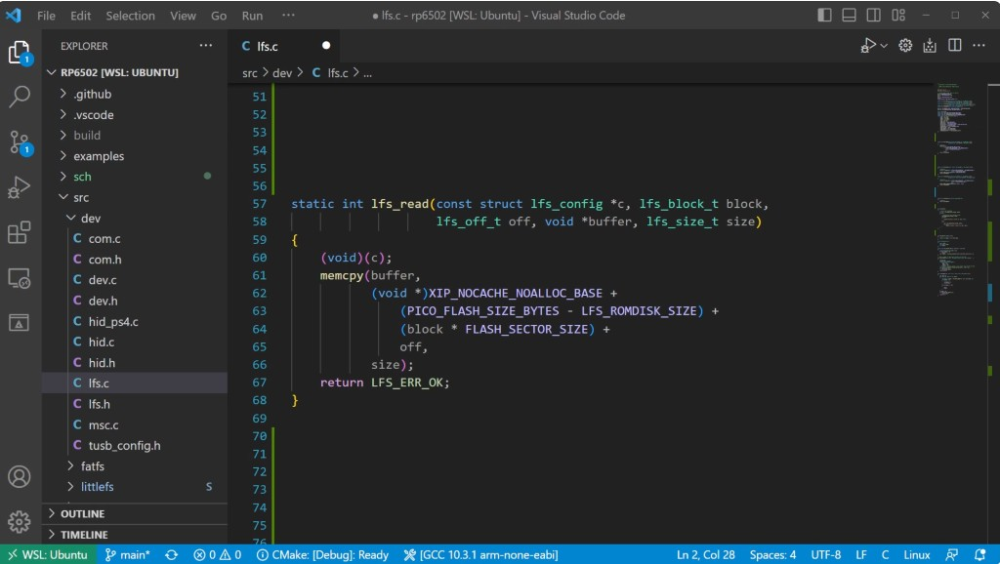

3. **Erase / program:** **Erase** whole block, then **program** bytes — forwarded to **`flash_range_erase`** / **`flash_range_program`**.

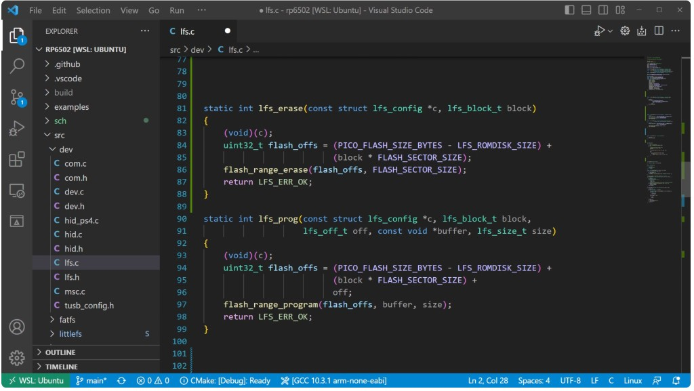

4. **First boot:** If **`lfs_mount()`** fails (unformatted), **format** and mount again (per littlefs README). Author doesn’t unmount on chip (not removable).

Then **`lfs_file_open` / read / write** — same “glue” idea as FatFs.

---

## 5. Picocomputer demo — USB mass storage

**Claim in video:** Loading and running a **real 6502** program from a **USB flash drive** (not only SD) may be a first for a **physical 6502** machine (FPGA seen elsewhere).

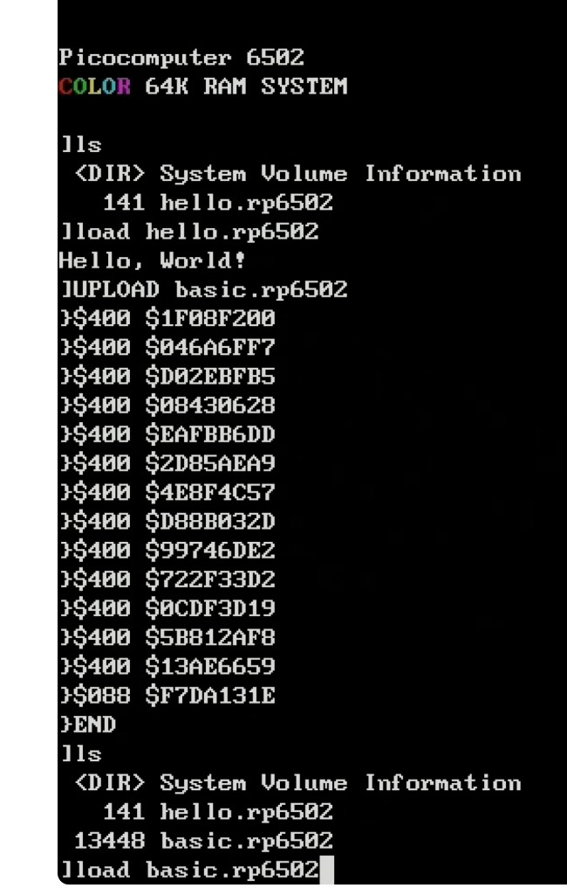

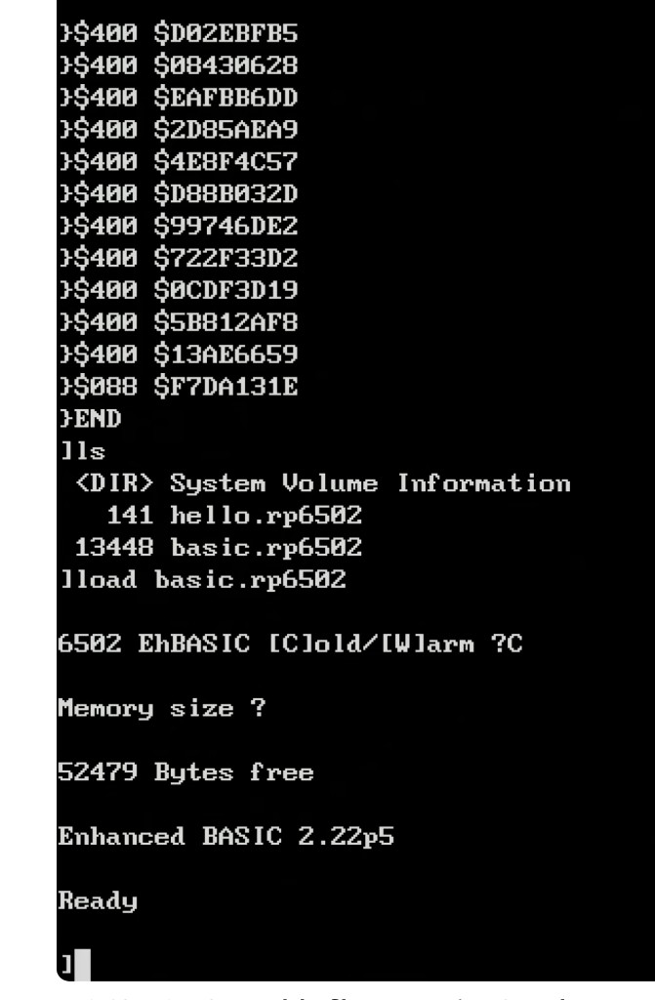

---

## 6. Fast iteration: build script + `UPLOAD`

Linux build script compiles **EhBASIC**; as a final step the binary is **uploaded** to the USB drive over the same USB connection (power + debug). No swapping the stick between machines. **Upload** arbitrary binaries and assets.

---

## 7. “ROMs” — install on RIA flash (littlefs)

Goal: **BASIC** (or **HELLO**) always available like a **C64 ROM** — not only from a removable drive.

- **`install <file>`** — copies the image into **RIA** internal storage.
- **`boot <rom|->`** — select default boot ROM; **`-`** = none.
- **`reboot`** — cold start and run the chosen ROM.

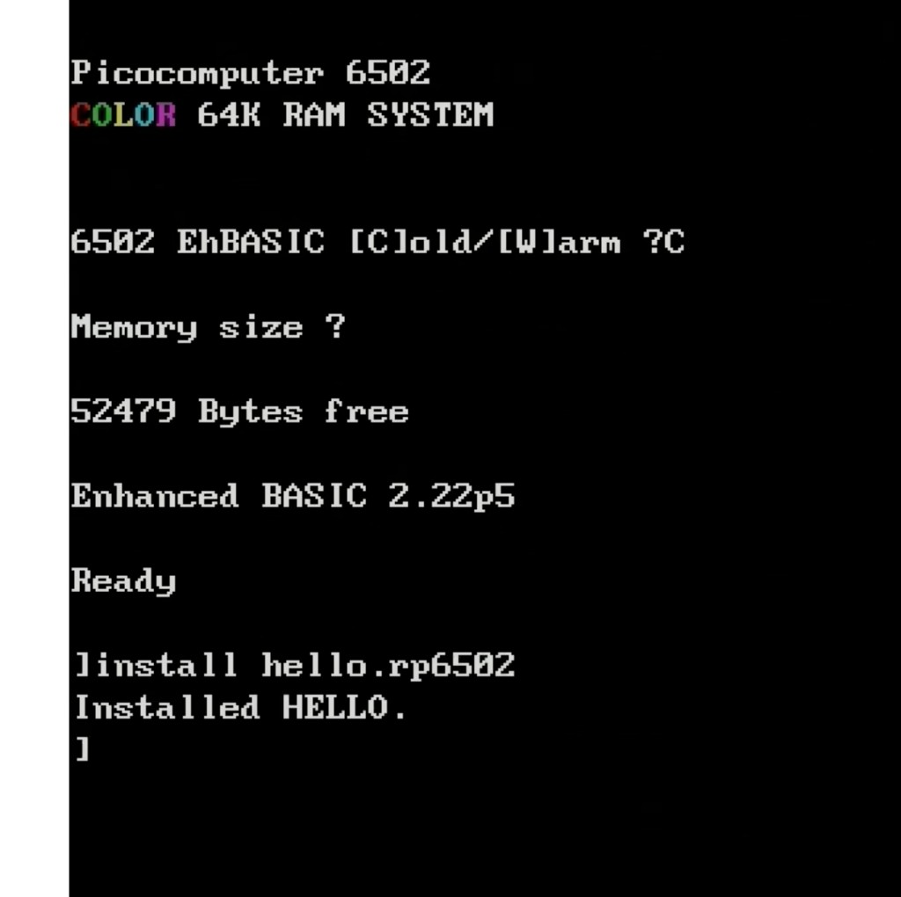

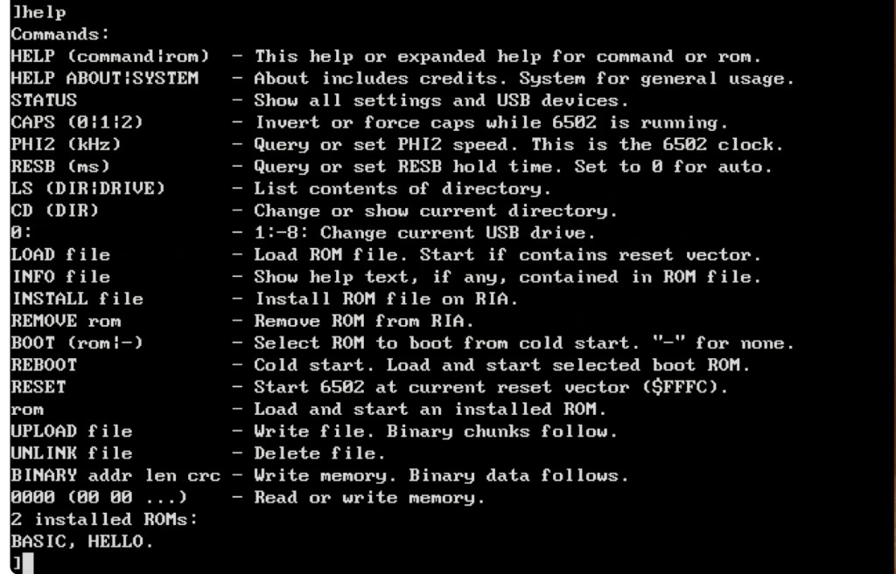

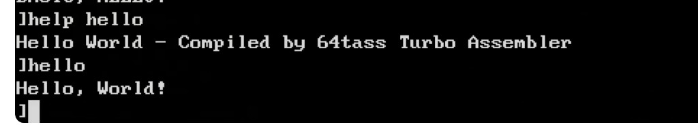

---

## 8. `status`, clock, multiple drives

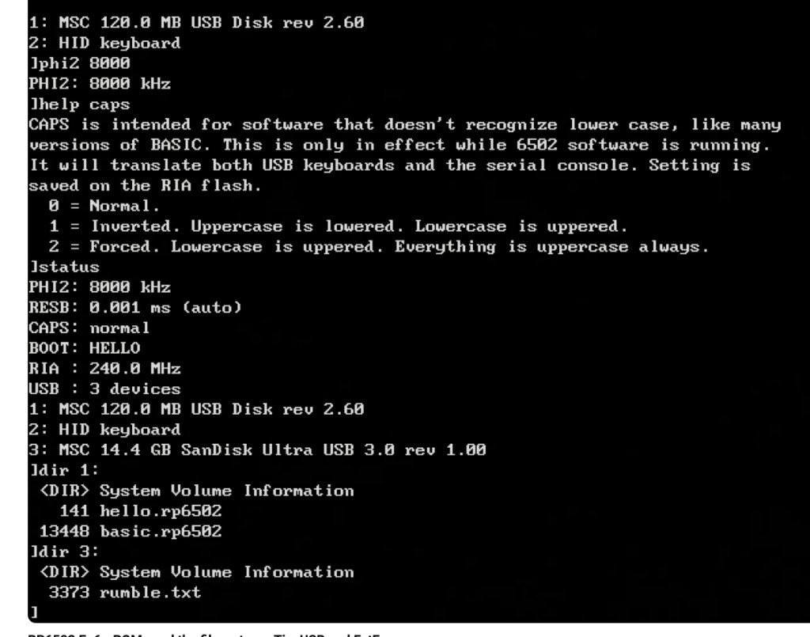

- **`phi2`** — set **6502 clock** from the console (no DIP switches); saved on RIA.
- **`help <topic>`** — e.g. **CAPS** for uppercase handling for software that doesn’t understand lowercase.
- **`dir` / `ls` with drive** — `0:` … **`n:`** for multiple USB mass-storage devices.

---

## 9. Teaser: floppy drives

Author ordered **3.5″ USB floppy drives** (~$20) and media (NOS); possible short **Patreon** demo if it works.

---

## Where this lives in the workspace

| Topic | Location (current rp6502) |
|-------|---------------------------|
| USB MSC + FatFs glue | `src/ria/usb/msc.c` (and `tinyusb` / `fatfs` trees) |
| littlefs on Pico flash | `src/ria/sys/lfs.c` |
| LittleFS library | `src/littlefs/` |
| Monitor commands (`load`, `install`, `boot`, …) | `src/ria/mon/` — see `mon.c`, `fil.c`, etc. |
| EhBASIC binary / build | **ehbasic** repo — see [ep05-ehbasic-demo.md](ep05-ehbasic-demo.md) |

---

## Screenshots

**13** screenshots from the episode are in **[ep06-assets/](ep06-assets/)** (`01`–`13`). One extra frame from the video (`install basic.rp6502` / `boot basic` / `reboot`) was not in the saved Cursor asset bundle; **`10-install-roms-boot-hello.png`** is the adjacent “ROM install / boot / HELLO” sequence from the same demo.

| File | Contents |
|------|----------|
| `01-diagram-fatfs-vs-littlefs.png` | tldraw: FatFs vs littlefs, SPI “NOPE” |
| `02-msc-disk_ioctl.png` | `disk_ioctl` |
| `03-msc-mount-unmount-fatfs.png` | `tuh_msc_mount_cb` / `umount_cb` |
| `04-msc-disk-read-write-wait.png` | `disk_read` / `disk_write` + wait |
| `05-lfs-config-structure.png` | `lfs_config` init |
| `06-lfs-read-xip-memcpy.png` | `lfs_read` / XIP |
| `07-lfs-erase-prog-flash-sdk.png` | `lfs_erase` / `lfs_prog` |
| `08-picocomputer-ls-load-upload.png` | `ls`, `load`, `UPLOAD` |
| `09-load-basic-from-usb.png` | EhBASIC from USB |
| `10-install-roms-boot-hello.png` | install / boot ROMs |
| `11-help-installed-roms.png` | `help` + ROM list |
| `12-help-hello-command.png` | `help hello` / `hello` |
| `13-status-multiple-usb-drives.png` | `status`, `dir` on two drives |

---

## Summary

| Item | Description |
|------|-------------|
| **FAT** | FatFs; removable USB (TinyUSB MSC); ExFAT licensing/support |
| **littlefs** | Internal flash; wear leveling; format-on-first-fail |
| **Glue** | IOCTL + mount + read/write (MSC); lfs_config + XIP read + flash erase/program |
| **Picocomputer** | `load` from USB, `UPLOAD`, `install`/`boot` ROMs, `help`, `status`, multi-drive |
| **Next (video)** | USB floppy experiment (Patreon) |

---

## Official docs

- **Picocomputer / RP6502:** [picocomputer.github.io](https://picocomputer.github.io/index.html) — OS, monitor, hardware when you need cross-checks.
